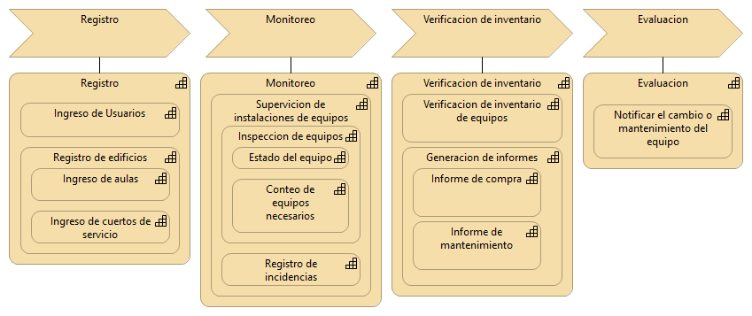

<h1 align="center"> Checklist de Estado de Campus 
</h1>

<i>
Version 1.0 
</i>

**_Autores_**
+ [Freddy Leon](https://github.com/Freddyleonn16) - Quality Assurance
+ [Carolina Alvarado](https://github.com/carolaljime21), UX/UI Developer
+ [Byron Castillo](https://github.com/ByronCast09), Frontend Developer
+ [Kevin Barrazueta](https://github.com/0KevinB), Security Manager
+ [Kevin Bustamante](), Backend Developer
+ [Pablo Ramon](https://github.com/Pablo-26), Software Architect

> Mantener un registro actualizado del estado de las instalaciones del campus es esencial para garantizar un entorno seguro y adecuado para estudiantes y personal. Un aplicativo en la nube que facilite la creación y seguimiento de checklists permitirá identificar y resolver problemas de manera oportuna, mejorando la calidad del entorno universitario. La computación en la nube asegurará que los datos sean accesibles desde cualquier dispositivo y en cualquier momento.*

La propuesta tiene como objetivo desarrollar una aplicación móvil que permita gestionar de manera eficiente las verificaciones de los diferentes espacios del campus universitario mediante listas de control (checklists). La aplicación permitirá a los usuarios crear tareas específicas para la inspección de aulas, laboratorios, y otros espacios, y compartir esta información con el personal autorizado para que verifiquen y completen dichas tareas.
Cada tarea incluirá un checklist detallado y deberá ser completado por todos los usuarios involucrados. Solo cuando cada uno de los usuarios haya verificado y marcado su parte de la tarea como realizada, el sistema moverá automáticamente la tarea al apartado de "tareas completadas". Esto proporcionará un control preciso y un seguimiento eficiente del mantenimiento y estado de los espacios del campus.

### Funcionalidades principales
- **Creación y asignación de tareas:** Los usuarios podrán crear y asignar tareas de verificación con checklists detallados.
- **estión colaborativa de tareas:** Las tareas podrán ser compartidas entre varios usuarios, y todas las partes deben verificar su cumplimiento para que se considere completada.
- **Apartados de espacios:** Cada área del campus (aulas, laboratorios, salas de cómputo) tendrá un listado detallado de elementos como iluminación, proyectores, escritorios, etc., con opciones para ingresar descripciones, estados y cantidades de artículos.
- **Registro de incidencias:** Los usuarios podrán agregar descripciones, fotos y etiquetas a los ítems que requieran mantenimiento o que presenten problemas.
- **Acceso seguro:** Cada estudiante o miembro del personal accederá a la aplicación mediante credenciales únicas, lo que garantiza un control de acceso personalizado a las diferentes secciones del sistema.

### Tecnologías Empleadas
El desarrollo de la aplicación está basado en tecnologías modernas que permiten una experiencia de usuario fluida y eficiente tanto para dispositivos Android como iOS.

  
  

## Proceso de desarrollo de la propuesta

### 1) Hacer y detallar los requisitos del negocio 

Dentro de esta sección hablaremos de la problemática a resolver, siendo lo más detallado posible para poder conocer todo el contexto y poder dar una solución efectiva que satisfaga los estándares de la empresa que nos confió su problemática. Se va a recolectar información sobre los problemas actuales del campus respecto al seguimiento del estado de las instalaciones, y se definen los objetivos que se buscan alcanzar con la solución. 

### 2) Oportunidad de negocio 

Se analizará el valor de esta solución que se puede aportar al campus y si es posible fuera del campus, se narrará los beneficios tangibles e intangibles conforme a nuestra solución planteada 

Aplicaciones de checklist para mantenimiento de campus 

#### 2.1) iAuditor by SafetyCulture  

-) Características principales:  

* Creación de checklists personalizables 

* Captura de fotos y anotaciones 

* Generación de informes en tiempo real 

* Asignación de tareas y seguimiento 

-) Ventajas:  

* Interfaz intuitiva 

* Amplia biblioteca de plantillas 

-) Desventajas:  

* Puede ser costoso para equipos grandes 

#### 2.2) Facility Management eXpress (FMX)  

-) Características principales:  

* Gestión de mantenimiento preventivo 

* Seguimiento de activos 

* Programación de tareas 

-) Ventajas:  

* Específicamente diseñado para gestión de instalaciones 

* Buena integración con otros sistemas 

-) Desventajas:  

* Puede ser complejo para usuarios no técnicos 

#### 2.3) UpKeep 

-) Características principales:  

* Gestión de órdenes de trabajo 

* Seguimiento de inventario 

* Análisis y reportes 

-) Ventajas:  

* Interfaz móvil amigable 

* Buena para equipos de mantenimiento 

-) Desventajas:  

* Puede tener más funciones de las necesarias para un campus 

#### 2.4) Checklist.com  

-) Características principales:  

* Creación simple de checklists 

* Colaboración en tiempo real 

* Integración con otras aplicaciones 

-) Ventajas:  

* Fácil de usar 

* Versión gratuita disponible 

-) Desventajas:  

* Puede carecer de funciones específicas para mantenimiento de campus 

#### 2.5) MaintainX  

-) Características principales:  

* Gestión de procedimientos operativos estándar 

* Comunicación en tiempo real 

* Seguimiento de métricas 

-) Ventajas:  

* Buena para la comunicación del equipo 

* Interfaz móvil intuitiva 

-) Desventajas:  

* Algunas funciones avanzadas solo en planes premium 

 

### 3) Objetivos del negocio 

Narraremos los objetivos específicos que nosotros como empresa queremos lograr con la aplicación 

 

### 4) Riesgos potenciales 

Describiremos los posibles riesgos ya sean a futuro o durante el desarrollo de nuestra solución, entre ellos encontraremos riesgos de conectividad, accesibilidad o de integración; a su vez con su respectiva solución para estar prevenidos. 

 

### 5) Alcance y limitaciones 

Estableceremos las limitaciones que existen como el tiempo disponible, los recursos técnicos y humanos, y las limitaciones tecnológicas. Usaremos una herramienta para poder gestionar estas tareas como Jira 

 

### 6) Requisitos funcionales y no funcionales 

 **_Requisitos Funcionales Clave:_** 

- Autenticación y autorización de usuarios 

- Gestión de checklists personalizados 

- Realización de inspecciones con captura de fotos y anotaciones 

- Asignación y seguimiento de tareas 

- Generación de informes y dashboards 

- Sistema de notificaciones 

**_Requisitos No Funcionales Clave:_** 

- Rendimiento: Carga rápida y soporte para múltiples usuarios concurrentes 

- Seguridad: Encriptación de datos y autenticación segura 

- Disponibilidad: 99.9% de tiempo de actividad 

- Usabilidad: Interfaz intuitiva y accesible 

- Escalabilidad: Arquitectura que permite crecimiento futuro 

 

### 7) Arquitectura de alto nivel 

- Servicio de Autenticación y Autorización 

- Servicio de Gestión de Usuarios 

- Servicio de Gestión de Instalaciones 

- Servicio de Gestión de Checklists 

- Servicio de Inspecciones 

- Servicio de Tareas 

- Servicio de Notificaciones 

- Servicio de Reportes y Análisis 

- Servicio de Almacenamiento de Archivos 

- API Gateway 

 

<h2> Mapa de Capacidades </h2>

  <i>
  Figure 1 - Mapa de capacidades de la UTPL  
  </i>

